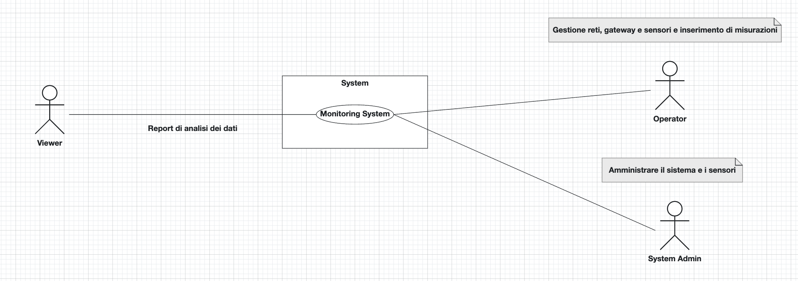

# Requirements Document - GeoControl

Date:

Version: V1 - description of Geocontrol as described in the swagger

| Version number | Change |
| :------------: | :----: |
|                |        |

# Contents

- [Requirements Document - GeoControl](#requirements-document---geocontrol)
- [Contents](#contents)
- [Informal description](#informal-description)
- [Business model](#business-model)
- [Stakeholders](#stakeholders)
- [Context Diagram and interfaces](#context-diagram-and-interfaces)
  - [Context Diagram](#context-diagram)
  - [Interfaces](#interfaces)
- [Stories and personas](#stories-and-personas)
- [Functional and non functional requirements](#functional-and-non-functional-requirements)
  - [Functional Requirements](#functional-requirements)
  - [Non Functional Requirements](#non-functional-requirements)
- [Use case diagram and use cases](#use-case-diagram-and-use-cases)
  - [Use case diagram](#use-case-diagram)
    - [Use case 1, UC1](#use-case-1-uc1)
      - [Scenario 1.1](#scenario-11)
      - [Scenario 1.2](#scenario-12)
      - [Scenario 1.x](#scenario-1x)
    - [Use case 2, UC2](#use-case-2-uc2)
    - [Use case x, UCx](#use-case-x-ucx)
- [Glossary](#glossary)
- [System Design](#system-design)
- [Deployment Diagram](#deployment-diagram)

# Informal description

GeoControl is a software system designed for monitoring physical and environmental variables in various contexts: from hydrogeological analyses of mountain areas to the surveillance of historical buildings, and even the control of internal parameters (such as temperature or lighting) in residential or working environments.

# Business Model

<!-- 1- Goverment Public Model perché in prima battuta venduto per la regione Piemonte

2- Data Monetization Model (Vendita dei dati a enti pubblici o privati con tariffe personalizzate?)

3- Software Licensing Model  -->

GeoControl è un sistema che raccoglie dati da sensori, li elabora e consente di immagazzinarli per rilevare specifiche variazioni nel sistema geografico piemontese in termini di temperatura, umidità e luminosità. Il progetto è stato commissionato dall'Unione delle Comunità Montane del Piemonte con l'obiettivo di monitorare le condizioni idrogeologiche del territorio, prestando particolare attenzione allo stato degli edifici storici e degli ambienti lavorativi e residenziali nelle zone montane. Grazie alla sua struttura modulare, il sistema fornisce le informazioni raccolte a enti sia pubblici che privati, garantendo un elevato livello di accuratezza nella misurazione dei dati.

# Stakeholders

| Stakeholder name | Description |
| :--------------: | :---------: |
| System Admin     | Amministrare il sistema e i sensori |
| Software Developers | Sviluppare e testare il sistema |
| Providers | Fornire hardware/software per il supporto del sistema |
| Users            | Visualizzare ed utilizzare i dati acquisiti |
| Operators        | Gestire il sistema modificando/aggiungendo dati |

# Context Diagram and interfaces

## Context Diagram

## Interfaces

\<describe here each interface in the context diagram>

|   Actor   | Logical Interface | Physical Interface |
| :-------: | :---------------: | :----------------: |
| System Admin |  Base GUI + commad line interface | Screen, keyboard|
| Viewer | Base GUI | Screen, keyboard |
| Operator | Base GUI + .. | Screen, keyboard | 

# Stories and personas

\<A Persona is a realistic impersonation of an actor. Define here a few personas and describe in plain text how a persona interacts with the system>

\<Persona is-an-instance-of actor>

\<stories will be formalized later as scenarios in use cases>

# Functional and non functional requirements

## Functional Requirements

\<In the form DO SOMETHING, or VERB NOUN, describe high level capabilities of the system>

\<they match to high level use cases>

|  ID   | Description |
| :---: | :---------: |
|  FR1  |             |
|  FR2  |             |
| FRx.. |             |

## Non Functional Requirements

\<Describe constraints on functional requirements>

|   ID    | Type (efficiency, reliability, ..) | Description | Refers to |
| :-----: | :--------------------------------: | :---------: | :-------: |
|  NFR1   |                                    |             |           |
|  NFR2   |                                    |             |           |
|  NFR3   |                                    |             |           |
| NFRx .. |                                    |             |           |

# Use case diagram and use cases

## Use case diagram

\<define here UML Use case diagram UCD summarizing all use cases, and their relationships>

\<next describe here each use case in the UCD>

### Use case 1, UC1

| Actors Involved  |                                                                      |
| :--------------: | :------------------------------------------------------------------: |
|   Precondition   | \<Boolean expression, must evaluate to true before the UC can start> |
|  Post condition  |  \<Boolean expression, must evaluate to true after UC is finished>   |
| Nominal Scenario |         \<Textual description of actions executed by the UC>         |
|     Variants     |                      \<other normal executions>                      |
|    Exceptions    |                        \<exceptions, errors >                        |

##### Scenario 1.1

\<describe here scenarios instances of UC1>

\<a scenario is a sequence of steps that corresponds to a particular execution of one use case>

\<a scenario is a more formal description of a story>

\<only relevant scenarios should be described>

|  Scenario 1.1  |                                                                            |
| :------------: | :------------------------------------------------------------------------: |
|  Precondition  | \<Boolean expression, must evaluate to true before the scenario can start> |
| Post condition |  \<Boolean expression, must evaluate to true after scenario is finished>   |
|     Step#      |                                Description                                 |
|       1        |                                                                            |
|       2        |                                                                            |
|      ...       |                                                                            |

##### Scenario 1.2

##### Scenario 1.x

### Use case 2, UC2

..

### Use case x, UCx

..

# Glossary

\<use UML class diagram to define important terms, or concepts in the domain of the application, and their relationships>

\<concepts must be used consistently all over the document, ex in use cases, requirements etc>

# System Design

\<describe here system design>

\<must be consistent with Context diagram>

# Deployment Diagram

\<describe here deployment diagram >
