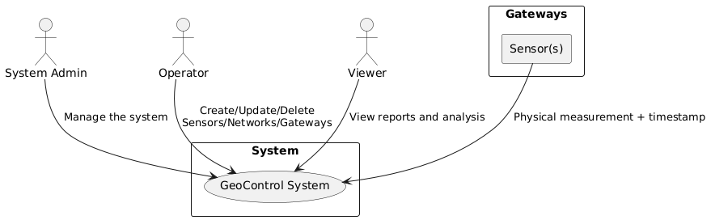

# Requirements Document - GeoControl

Date:

Version: V1 - description of Geocontrol as described in the swagger

| Version number | Change |
| :------------: | :----: |
|                |        |

# Contents

- [Requirements Document - GeoControl](#requirements-document---geocontrol)
- [Contents](#contents)
- [Informal description](#informal-description)
- [Business model](#business-model)
- [Stakeholders](#stakeholders)
- [Context Diagram and interfaces](#context-diagram-and-interfaces)
  - [Context Diagram](#context-diagram)
  - [Interfaces](#interfaces)
- [Stories and personas](#stories-and-personas)
- [Functional and non functional requirements](#functional-and-non-functional-requirements)
  - [Functional Requirements](#functional-requirements)
  - [Non Functional Requirements](#non-functional-requirements)
- [Use case diagram and use cases](#use-case-diagram-and-use-cases)
  - [Use case diagram](#use-case-diagram)
    - [Use case 1, UC1](#use-case-1-uc1)
      - [Scenario 1.1](#scenario-11)
      - [Scenario 1.2](#scenario-12)
      - [Scenario 1.x](#scenario-1x)
    - [Use case 2, UC2](#use-case-2-uc2)
    - [Use case x, UCx](#use-case-x-ucx)
- [Glossary](#glossary)
- [System Design](#system-design)
- [Deployment Diagram](#deployment-diagram)

# Informal description

GeoControl is a software system designed for monitoring physical and environmental variables in various contexts: from hydrogeological analyses of mountain areas to the surveillance of historical buildings, and even the control of internal parameters (such as temperature or lighting) in residential or working environments.

# Business Model

<!-- 1- Goverment Public Model perché in prima battuta venduto per la regione Piemonte

2- Data Monetization Model (Vendita dei dati a enti pubblici o privati con tariffe personalizzate?)

3- Software Licensing Model  -->

GeoControl has been commissioned by the Union of Mountain Communities of the Piedmont Region, it will generate its primary revenue through this institutional partnership, reflecting the strategic importance of regional hydrogeological monitoring. At the same time, the platform can expand its reach by being commercialized to other public and private organizations that require high-frequency and reliable environmental data collection with customized licensing agreements.

# Stakeholders

| Stakeholder           | Description                                                                             |
|:---------------------:|:---------------------------------------------------------------------------------------:|
| System Administrator  | Manage the system, full access to all resources, including user and network management. |
| Software Developers   | Develop and test the system software                                                    |
| Providers             | Supply hardware/software to support the system                                          |
| Users/Viewer          | Access and utilize acquired data, report and analysis                                   |
| Operators             | Manage networks and insert measurements                                                 |

# Context Diagram and interfaces

## Context Diagram

## Interfaces

| **Actor/Element**         | **Logical Interface**                                                                  | **Physical Interface**                                               |
|---------------------------|----------------------------------------------------------------------------------------|----------------------------------------------------------------------|
| **System Administrator**  | - Web Admin GUI - Command Line Interface (CLI) via SSH                              | - PC/Laptop with keyboard and screen - VPN/Remote network         |
| **Operator**              | - Web GUI (for network/sensor management) - API (if scripted)                       | - PC/Tablet - Physical connections to gateways (serial/USB)       |
| **Viewer**                | - Web GUI (read-only) - API (read-only)                                             | - PC/Smartphone/Tablet with browser                                  |
| **Sensor (device)**       | - Serial/Modbus protocol (or similar) - Transmission of raw data (timestamp + value)| - Serial cable/wireless connection - Battery or AC power supply   |
| **Gateway (device)**      | - Embedded software for data processing - Network protocol (HTTP, MQTT, etc.)       | - Network interface (Ethernet/4G) - Serial/USB input ports        |

# Stories and personas

### **Persona 1:**  
**Elena, 37 years old, works for the Union of Mountain Communities of the Piedmont Region.** She is responsible for monitoring environmental data in mountainous areas.   

- **Story N1:** Elena logs into the GeoControl system to access the data she is interested.

- **Story N2:** Elena needs to check which networks are currently active. She views the list of available networks in GeoControl.  

- **Story N3:** Elena selects a specific network and views its detailed information.  

- **Story N4:** Elena needs to inspect the hardware setup. She views the list of all gateways connected to the selected network.  

- **Story N5:** She clicks on a gateway to check it, accessing all relevant gateway information.  

- **Story N6:** Elena wants to analyze individual sensors. She views the list of sensors linked to a specific gateway.  

- **Story N7:** She selects one sensor to check its information.  

- **Story N8:** Elena wants to evaluate the environmental data. She retrieves the list of all measurements collected by sensors in a specific network.  

- **Story N9:** To get an overview, Elena views a set of aggregated statistics for all sensors in the selected network.  

- **Story N10:** Elena is interested in anomalies. She filters the measurement list from a set of sensors from a network to show only the data identified as outliers.  

- **Story N11:** She focuses on one particular sensor and retrieves all measurements collected by that sensor.  

- **Story N12:** She then views the statistics specifically related to that single sensor.  

- **Story N13:** Finally, Elena wants to investigate anomalies from that single sensor. She filters the sensor’s data to display only the outliers.

### **Persona 2:**  
**Luca, 42 years old, is the CTO of a private company.** His company uses GeoControl to monitor indoor conditions in their commercial buildings.

- **Story N1:** He logs into GeoControl daily to monitor client-specific networks and sensor statuses.  

- **Story N2:** Luca wants to audit the different networks his company monitors. He views the full list of networks available.  

- **Story N3:** Luca views the list of gateways for a network that represents an office building.  

- **Story N4:** He clicks on a gateway to check information details.  

- **Story N5:** Luca explores which sensors are installed in a particular area, accessing the sensor list of a specific gateway.  

- **Story N6:** He selects a sensor to retrieve its information.  

- **Story N7:** Luca pulls all environmental measurements collected by the sensors in a network that represents an building.  

- **Story N8:** Luca views the network statistics.  

- **Story N9:** Luca filters all the network's measurements to identify only the outliers that might indicate a fault or critical environmental change.  

- **Story N10:** He checks the measurement history of a specific sensor in a room.  

- **Story N11:** He views detailed statistics for that sensor.  

- **Story N12:** Finally, Luca filters the sensor’s data to identify outliers.

### **Persona 3:**  
**Giulia, 39 years old, is the system administrator.** She is responsible for managing users, networks, gateways, and sensors.

- **Story N1:** Giulia creates new user account for a company that bought the GeoControl monitoring software.

- **Story N2:** She wants to review existing accounts. Giulia retrieves the list of all registered users.  

- **Story N3:** A colleague requests support. Giulia looks up a specific user's profile to check their role and information.  

- **Story N4:** An old account is no longer needed. Giulia deletes the user from the system to maintain security.  

- **Story N5:** Giulia is setting up a new monitoring area. She creates a new network in GeoControl.  

- **Story N6:** She notices incorrect data in a network. Giulia updates the network information.  

- **Story N7:** A network is no longer in use. Giulia deletes the network to keep the system organized.  

- **Story N8:** Giulia needs to include the provided hardware. She creates a new gateway and links it to an existing network.  

- **Story N9:** She receives updated specs from the hardware provider. Giulia modifies the configuration of an existing gateway.  

- **Story N10:** A faulty gateway has been removed. Giulia deletes it from it's network.  

- **Story N11:** Giulia registers a new sensor under a specific gateway.  

- **Story N12:** After a firmware upgrade, Giulia updates the sensor's information.  

- **Story N13:** One sensor has been permanently damaged. Giulia deletes it from the network it was associated.  

- **Story N14:** Giulia manually stores a measurement in the system for testing purposes.

### **Persona 4:**  
**Marco, 34 years old, is a system operator.** He is responsible for managing networks, gateways, and sensors.

- **Story N1:** Marco creates a new network in GeoControl for a new monitoring area. 

- **Story N2:** Marco needs to modify the configuration of a network. He updates the network information in GeoControl.

- **Story N3:** Marco deletes a network that is no longer in use. He removes it from the system.

- **Story N4:** Marco needs to include new equipment hardware provided. He adds a new gateway and links it to the appropriate network.  

- **Story N3:** Marco updates the information of a gateway.  

- **Story N4:** He needs to add a new sensor connected to the gateway. Marco registers it in the system.  

- **Story N5:** A sensor is reporting inaccurate data. Marco updates the sensor information.  

- **Story N6:** Marco removes a sensor that is no longer needed. He deletes it from the network it was associated.

- **Story N7:** Marco manually inserts a measurement into the system for a newly installed sensor.

# Functional and non functional requirements

## Functional Requirements

|  ID   | Description |
| :---: | :---------: |
|  **FR 1** | **Manage Authentication Process** |
|  FR 1.1 | Login (Authentication with username and password) |
|  FR 1.2 | Logout |
|  FR 1.3 | Token generation and release (Retrieve session token for API authorization) |
|  **FR 2**   | **Manage Account Types** |
|  **FR 2.1** | **Manage Admin Role** | 
|  FR 2.1.1 | Manage Users (Operations with accounts and role management (assign/revoke privileges)) |
|  FR 2.1.1.1 | Create a new User | 
|  FR 2.1.1.2 | Retrieve all Users | 
|  FR 2.1.1.3 | Retrieve a specific User |
|  FR 2.1.1.4 | Delete a User | 
|  FR 2.1.2 | Manage Networks | 
|  FR 2.1.2.1 | Create a new Network | 
|  FR 2.1.2.2 | Update a Network |
|  FR 2.1.2.3 | Delete a Network | 
|  FR 2.1.3 | Manage Gateways |
|  FR 2.1.3.1 | Create a new Gateway for a Network | 
|  FR 2.1.3.2 | Update a Gateway for a Network | 
|  FR 2.1.3.3 | Delete a Gateway for a Network | 
|  FR 2.1.4 | Manage Sensors |
|  FR 2.1.4.1 | Create a new Sensor for a Gateway |
|  FR 2.1.4.2 | Update a Sensor for a Gateway | 
|  FR 2.1.4.3 | Delete a Sensor for a Gateway | 
|  FR 2.1.4.4 | Store mesaurement for a Sensor | 
|  **FR 2.2** | **Manage Operator Role** |
|  FR 2.2.1 | Manage Networks => FR 2.1.2 |
|  FR 2.2.2 | Manage Gateways => FR 2.1.3  |
|  FR 2.2.3 | Manage Sensors => FR 2.1.4 |
|  **FR 2.3** | **Manage Viewer Role** (User with read-only access) |
|  FR 2.3.1 | Manage Data Consultation => FR 3 |
|  **FR 3** | **Retrieve informations** | 
|  FR 3.1 | Retrieve all networks | 
|  FR 3.2 | Retrieve a specific network | 
|  FR 3.3 | Retrieve all gateways of a network | 
|  FR 3.4 | Retrieve a specific gateway |
|  FR 3.5 | Retrieve all sensors of a gateway | 
|  FR 3.6 | Retrieve a specific sensor | 
|  FR 3.7 | Retrieve Measurements |
|  FR 3.7.1 | Retrieve measurements for a set of specific network |
|  FR 3.7.2 | Retrieve measurements for a specific sensor |
|  FR 3.8 | Retrieve Statistics | 
|  FR 3.8.1 | Calculate Statistics (Mean and variance calculation) |
|  FR 3.8.2 | Retrieve only statistics for a set of sensors of a specific network | 
|  FR 3.8.3 | Calculate Threshold (Determining outliers or anomalous measurements) |
|  FR 3.8.4 | Retrieve only outliers measurements for a set of sensors of a specific network | 
|  FR 3.8.5 | Retrieve statistics for a specific sensor | 
|  FR 3.8.6 | Retrieve only outliers measurements for a specific sensor | 

## Non Functional Requirements

\<Describe constraints on functional requirements>

|   ID    | Type (efficiency, reliability, ..) | Description | Refers to |
| :-----: | :--------------------------------: | :---------: | :-------: |
|  NFR1   |                                    |             |           |
|  NFR2   |                                    |             |           |
|  NFR3   |                                    |             |           |
| NFRx .. |                                    |             |           |

# Use case diagram and use cases

## Use case diagram

\<define here UML Use case diagram UCD summarizing all use cases, and their relationships>

\<next describe here each use case in the UCD>

### Use case 1, UC1

| Actors Involved  |                                                                      |
| :--------------: | :------------------------------------------------------------------: |
|   Precondition   | \<Boolean expression, must evaluate to true before the UC can start> |
|  Post condition  |  \<Boolean expression, must evaluate to true after UC is finished>   |
| Nominal Scenario |         \<Textual description of actions executed by the UC>         |
|     Variants     |                      \<other normal executions>                      |
|    Exceptions    |                        \<exceptions, errors >                        |

##### Scenario 1.1

\<describe here scenarios instances of UC1>

\<a scenario is a sequence of steps that corresponds to a particular execution of one use case>

\<a scenario is a more formal description of a story>

\<only relevant scenarios should be described>

|  Scenario 1.1  |                                                                            |
| :------------: | :------------------------------------------------------------------------: |
|  Precondition  | \<Boolean expression, must evaluate to true before the scenario can start> |
| Post condition |  \<Boolean expression, must evaluate to true after scenario is finished>   |
|     Step#      |                                Description                                 |
|       1        |                                                                            |
|       2        |                                                                            |
|      ...       |                                                                            |

##### Scenario 1.2

##### Scenario 1.x

### Use case 2, UC2

..

### Use case x, UCx

..

# Glossary

\<use UML class diagram to define important terms, or concepts in the domain of the application, and their relationships>

\<concepts must be used consistently all over the document, ex in use cases, requirements etc>

# System Design

\<describe here system design>

\<must be consistent with Context diagram>

# Deployment Diagram

\<describe here deployment diagram >
