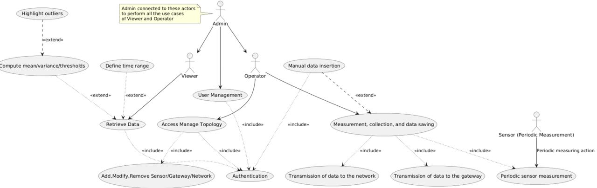
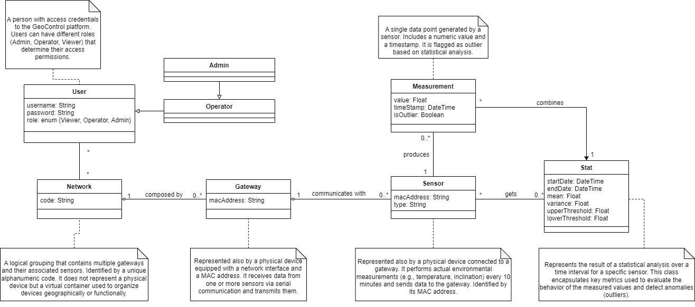
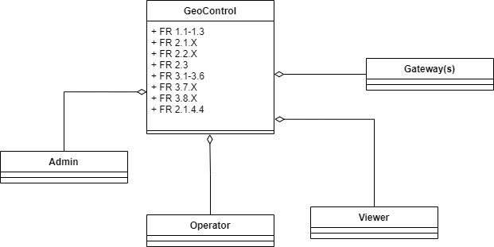
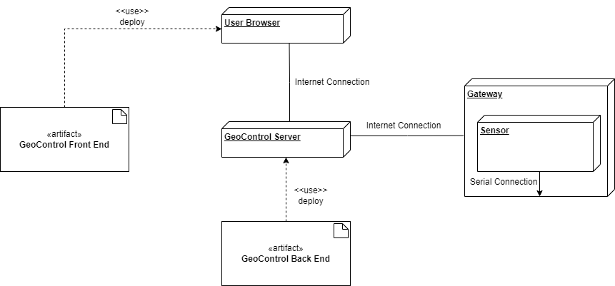

# Requirements Document - GeoControl

Date:

Version: V1 - description of Geocontrol as described in the swagger

| Version number | Change |
| :------------: | :----: |
|       V1       |   1.0  |

# Contents
- [Requirements Document - GeoControl](#requirements-document---geocontrol)
- [Contents](#contents)
- [Informal description](#informal-description)
- [Business model](#business-model)
- [Stakeholders](#stakeholders)
- [Context Diagram and interfaces](#context-diagram-and-interfaces)
  - [Context Diagram](#context-diagram)
  - [Interfaces](#interfaces)
- [Stories and personas](#stories-and-personas)
- [Functional and non functional requirements](#functional-and-non-functional-requirements)
  - [Functional Requirements](#functional-requirements)
  - [Non Functional Requirements](#non-functional-requirements)
- [Use case diagram and use cases](#use-case-diagram-and-use-cases)
  - [Use case diagram](#use-case-diagram)
    - [Use case 1, UC1 - Authentication](#use-case-1-uc1---authentication)
      - [Scenario 1.1 - Successful authentication](#scenario-11---successful-authentication)
      - [Scenario 1.2 - Wrong credentials or user not found](#scenario-12---wrong-credentials-or-user-not-found)
    - [Use case 2, UC2 – User Management](#use-case-2-uc2--user-management)
      - [Scenario 2.1 - Create new User](#scenario-21---create-new-user)
      - [Scenario 2.2 - View the list of all users](#scenario-22---view-the-list-of-all-users)
      - [Scenario 2.3 – View Specific User](#scenario-23--view-specific-user)
      - [Scenario 2.4 – Delete User](#scenario-24--delete-user)
    - [Use case 3, UC3 – Network Management](#use-case-3-uc3--network-management)
      - [Scenario 3.1 – Create Network](#scenario-31--create-network)
      - [Scenario 3.2 – List All Networks](#scenario-32--list-all-networks)
      - [Scenario 3.3 – Retrive a Specific Network](#scenario-33--retrive-a-specific-network)
      - [Scenario 3.4 – Update a Network](#scenario-34--update-a-network)
      - [Scenario 3.5 – Delete a Network](#scenario-35--delete-a-network)
    - [Use case 4, UC4 - Gateway Management](#use-case-4-uc4---gateway-management)
      - [Scenario 4.1 – Create Gateway](#scenario-41--create-gateway)
      - [Scenario 4.2 – List All Gateways in a Network](#scenario-42--list-all-gateways-in-a-network)
      - [Scenario 4.3 – Retrieve a Specific Gateway](#scenario-43--retrieve-a-specific-gateway)
      - [Scenario 4.4 – Update Gateway](#scenario-44--update-gateway)
      - [Scenario 4.5 – Delete Gateway](#scenario-45--delete-gateway)
    - [Use case 5, UC5 - Sensor Management](#use-case-5-uc5---sensor-management)
      - [Scenario 5.1 – Create a Sensor](#scenario-51--create-a-sensor)
      - [Scenario 5.2 – List all Sensors](#scenario-52--list-all-sensors)
      - [Scenario 5.3 – Retrieve a Specific Sensor](#scenario-53--retrieve-a-specific-sensor)
      - [Scenario 5.4 – Update Sensor](#scenario-54--update-sensor)
      - [Scenario 5.5 – Delete Sensor](#scenario-55--delete-sensor)
    - [Use case 6, UC6 - Insert Measurement](#use-case-6-uc6---insert-measurement)
      - [Scenario 6.1 – Insert One or More Measurements](#scenario-61--insert-one-or-more-measurements)
    - [Use case 7, UC7 - Retrieve Measurements](#use-case-7-uc7---retrieve-measurements)
      - [Scenario 7.1 – Retrieve Measurements for a Single Sensor](#scenario-71--retrieve-measurements-for-a-single-sensor)
      - [Scenario 7.2 – Retrieve Measurements for a Set of Sensors](#scenario-72--retrieve-measurements-for-a-set-of-sensors-of-a-specific-network-optionally-filtering-by-sensormacs)
      - [Scenario 7.3 – Retrieve only outliers measurements for a specific Sensor](#scenario-73--retrieve-only-outliers-measurements-for-a-specific-sensor)
      - [Scenario 7.4 - Retrieve only outliers measurements for a set of Sensors of a specific Network](#scenario-74--retrieve-only-outliers-measurements-for-a-set-of-sensors-of-a-specific-network-optionally-filtering-by-sensormacs)
    - [Use case 8, UC8 - Retrieve Statistics](#use-case-8-uc8---retrieve-statistics)
      - [Scenario 8.1 – Retrieve Statistics for a Single Sensor](#scenario-81--retrieve-statistics-for-a-single-sensor)
      - [Scenario 8.2 – Retrieve Statistics for a Set of Sensors of a specific Network](#scenario-82--retrieve-statistics-for-a-set-of-sensors-of-a-specific-network-optionally-filtering-by-sensormacs)
- [Glossary](#glossary)
- [System Design](#system-design)
- [Deployment Diagram](#deployment-diagram)

# Informal description

GeoControl is a software system designed for monitoring physical and environmental variables in various contexts: from hydrogeological analyses of mountain areas to the surveillance of historical buildings, and even the control of internal parameters (such as temperature or lighting) in residential or working environments.

# Business Model

GeoControl has been commissioned by the Union of Mountain Communities of the Piedmont Region, it will generate its primary revenue through this institutional partnership, reflecting the strategic importance of regional hydrogeological monitoring. At the same time, the platform can expand its reach by being commercialized to other public and private organizations that require high-frequency and reliable environmental data collection with customized licensing agreements.

# Stakeholders

| Stakeholder           | Description                                                                             |
|:---------------------:|:---------------------------------------------------------------------------------------:|
| System Administrator  | Manage the system, full access to all resources, including user and network management. |
| Software Developers   | Develop and test the system software                                                    |
| Providers             | Supply hardware/software to support the system                                          |
| Users/Viewer          | Access and utilize acquired data, report and analysis                                   |
| Operators             | Manage networks and insert measurements                                                 |

# Context Diagram and interfaces

## Context Diagram

## Interfaces

| **Actor/Element**         | **Logical Interface**                                                                  | **Physical Interface**                                               |
|---------------------------|----------------------------------------------------------------------------------------|----------------------------------------------------------------------|
| **System Administrator**  | - Web Admin GUI - Command Line Interface (CLI) via SSH                              | - PC/Laptop with keyboard and screen - VPN/Remote network         |
| **Operator**              | - Web GUI (for network/sensor management) - API (if scripted)                       | - PC/Tablet - Physical connections to gateways (serial/USB)       |
| **Viewer**                | - Web GUI (read-only) - API (read-only)                                             | - PC/Smartphone/Tablet with browser                                  |
| **Sensor (device)**       | - Serial/Modbus protocol (or similar) - Transmission of raw data (timestamp + value)| - Serial cable/wireless connection - Battery or AC power supply   |
| **Gateway (device)**      | - Embedded software for data processing - Network protocol (HTTP, MQTT, etc.)       | - Network interface (Ethernet/4G) - Serial/USB input ports        |

# Stories and personas

### **Persona 1:**  
**Elena, 37 years old, works for the Union of Mountain Communities of the Piedmont Region.** She is responsible for monitoring environmental data in mountainous areas.   

- **Story N1:** Elena logs into the GeoControl system to access the data she is interested.

- **Story N2:** Elena needs to check which networks are currently active. She views the list of available networks in GeoControl.  

- **Story N3:** Elena selects a specific network and views its detailed information.  

- **Story N4:** Elena needs to inspect the hardware setup. She views the list of all gateways connected to the selected network.  

- **Story N5:** She clicks on a gateway to check it, accessing all relevant gateway information.  

- **Story N6:** Elena wants to analyze individual sensors. She views the list of sensors linked to a specific gateway.  

- **Story N7:** She selects one sensor to check its information.  

- **Story N8:** Elena wants to evaluate the environmental data. She retrieves the list of all measurements collected by sensors in a specific network.  

- **Story N9:** To get an overview, Elena views a set of aggregated statistics for all sensors in the selected network.  

- **Story N10:** Elena is interested in anomalies. She filters the measurement list from a set of sensors from a network to show only the data identified as outliers.  

- **Story N11:** She focuses on one particular sensor and retrieves all measurements collected by that sensor.  

- **Story N12:** She then views the statistics specifically related to that single sensor.  

- **Story N13:** Finally, Elena wants to investigate anomalies from that single sensor. She filters the sensor’s data to display only the outliers.

### **Persona 2:**  
**Luca, 42 years old, is the CTO of a private company.** His company uses GeoControl to monitor indoor conditions in their commercial buildings.

- **Story N1:** He logs into GeoControl daily to monitor client-specific networks and sensor statuses.  

- **Story N2:** Luca wants to audit the different networks his company monitors. He views the full list of networks available.  

- **Story N3:** Luca views the list of gateways for a network that represents an office building.  

- **Story N4:** He clicks on a gateway to check information details.  

- **Story N5:** Luca explores which sensors are installed in a particular area, accessing the sensor list of a specific gateway.  

- **Story N6:** He selects a sensor to retrieve its information.  

- **Story N7:** Luca pulls all environmental measurements collected by the sensors in a network that represents an building specifing a date interval.  

- **Story N8:** Luca views the network statistics specifing a date interval. 

- **Story N9:** Luca filters all the network's measurements to identify only the outliers that might indicate a fault or critical environmental change.  

- **Story N10:** He checks the measurement history of a specific sensor in a room specifing a date interval.  

- **Story N11:** He views detailed statistics for that sensor specifing a date interval.  

- **Story N12:** Finally, Luca filters the sensor’s data to identify outliers specifing a date interval.

### **Persona 3:**  
**Giulia, 39 years old, is the system administrator.** She is responsible for managing users, networks, gateways, and sensors.

- **Story N1:** Giulia creates new user account to provide access to GeoControl monitoring software.

- **Story N2:** She wants to review existing accounts. Giulia retrieves the list of all registered users.  

- **Story N3:** A colleague requests support. Giulia looks up a specific user's profile to check their role and information.  

- **Story N4:** An old account is no longer needed. Giulia deletes the user from the system to maintain security.  

- **Story N5:** Giulia is setting up a new monitoring area. She creates a new network in GeoControl.  

- **Story N6:** She notices incorrect data in a network. Giulia updates the network information.  

- **Story N7:** A network is no longer in use. Giulia deletes the network to keep the system organized.  

- **Story N8:** Giulia needs to include the provided hardware. She creates a new gateway and links it to an existing network.  

- **Story N9:** She receives updated specs from the hardware provider. Giulia modifies the configuration of an existing gateway.  

- **Story N10:** A faulty gateway has been removed. Giulia deletes it from it's network.  

- **Story N11:** Giulia registers a new sensor under a specific gateway.  

- **Story N12:** After a firmware upgrade, Giulia updates the sensor's information.  

- **Story N13:** One sensor has been permanently damaged. Giulia deletes it from the network it was associated.  

- **Story N14:** Giulia manually stores a measurement in the system for testing purposes.

### **Persona 4:**  
**Marco, 34 years old, is a system operator.** He is responsible for managing networks, gateways, and sensors.

- **Story N1:** Marco creates a new network in GeoControl for a new monitoring area. 

- **Story N2:** Marco needs to modify the configuration of a network. He updates the network information in GeoControl.

- **Story N3:** Marco deletes a network that is no longer in use. He removes it from the system.

- **Story N4:** Marco needs to include new equipment hardware provided. He adds a new gateway and links it to the appropriate network.  

- **Story N3:** Marco updates the information of a gateway.  

- **Story N4:** He needs to add a new sensor connected to the gateway. Marco registers it in the system.  

- **Story N5:** A sensor is reporting inaccurate data. Marco updates the sensor information.  

- **Story N6:** Marco removes a sensor that is no longer needed. He deletes it from the network it was associated.

- **Story N7:** Marco manually inserts a measurement into the system for a newly installed sensor.

# Functional and non functional requirements

## Functional Requirements

|  ID   | Description |
| :---: | :---------: |
|  **FR 1** | **Manage Authentication Process** |
|  FR 1.1 | Login (Authentication with username and password) |
|  FR 1.2 | Logout |
|  FR 1.3 | Token generation and release (Retrieve session token for API authorization) |
|  **FR 2**   | **Manage Account Types** |
|  **FR 2.1** | **Manage Admin Role** | 
|  FR 2.1.1 | Manage Users (Operations with accounts and role management (assign/revoke privileges)) |
|  FR 2.1.1.1 | Create a new User | 
|  FR 2.1.1.2 | Retrieve all Users | 
|  FR 2.1.1.3 | Retrieve a specific User |
|  FR 2.1.1.4 | Delete a User | 
|  FR 2.1.2 | Manage Networks | 
|  FR 2.1.2.1 | Create a new Network | 
|  FR 2.1.2.2 | Update a Network |
|  FR 2.1.2.3 | Delete a Network | 
|  FR 2.1.3 | Manage Gateways |
|  FR 2.1.3.1 | Create a new Gateway for a Network | 
|  FR 2.1.3.2 | Update a Gateway for a Network | 
|  FR 2.1.3.3 | Delete a Gateway for a Network | 
|  FR 2.1.4 | Manage Sensors |
|  FR 2.1.4.1 | Create a new Sensor for a Gateway |
|  FR 2.1.4.2 | Update a Sensor for a Gateway | 
|  FR 2.1.4.3 | Delete a Sensor for a Gateway | 
|  FR 2.1.4.4 | Store mesaurement for a Sensor | 
|  **FR 2.2** | **Manage Operator Role** |
|  FR 2.2.1 | Manage Networks => FR 2.1.2 |
|  FR 2.2.2 | Manage Gateways => FR 2.1.3  |
|  FR 2.2.3 | Manage Sensors => FR 2.1.4 |
|  **FR 2.3** | **Manage Viewer Role** (User with read-only access) |
|  FR 2.3.1 | Manage Data Consultation => FR 3 |
|  **FR 3** | **Retrieve informations** | 
|  FR 3.1 | Retrieve all networks | 
|  FR 3.2 | Retrieve a specific network | 
|  FR 3.3 | Retrieve all gateways of a network | 
|  FR 3.4 | Retrieve a specific gateway |
|  FR 3.5 | Retrieve all sensors of a gateway | 
|  FR 3.6 | Retrieve a specific sensor | 
|  FR 3.7 | Retrieve Measurements |
|  FR 3.7.1 | Retrieve measurements for a set of specific network |
|  FR 3.7.2 | Retrieve measurements for a specific sensor |
|  FR 3.8 | Retrieve Statistics | 
|  FR 3.8.1 | Calculate Statistics (Mean and variance calculation) |
|  FR 3.8.2 | Retrieve only statistics for a set of sensors of a specific network | 
|  FR 3.8.3 | Calculate Threshold (Determining outliers or anomalous measurements) |
|  FR 3.8.4 | Retrieve only outliers measurements for a set of sensors of a specific network | 
|  FR 3.8.5 | Retrieve statistics for a specific sensor | 
|  FR 3.8.6 | Retrieve only outliers measurements for a specific sensor | 

## Non Functional Requirements

\<Describe constraints on functional requirements>

|   ID    | Type (efficiency, reliability, ..) | Description                                                                                                 | Refers to                          |
|:-------:|:----------------------------------:|:-----------------------------------------------------------------------------------------------------------:|:----------------------------------:|
|  NFR1   | Efficiency                         | The modular structure must support multiple networks and sensors without degrading performance.            | FR 3.7.1                           |
|  NFR2   | Reliability                        | Any value exceeding upper threshold or dropping below the lower threshold is flagged as outlier.           | FR 3.8.3                           |
|  NFR3   | Reliability                        | The system must ensure no more than six measurement losses per sensor per year.                            | FR 2.2.3, FR 3.7                   |
|  NFR4   | Performance                        | Each sensor sends a measurement every 10 minutes; the system must process and store all of them.           | FR 3.7                             |
|  NFR5   | Usability                          | Authenticated users must access data via Web GUI or API according to their roles.                          | FR 3                               |
|  NFR6   | Security                           | Token-based authentication must be used in Authorization headers.                                          | FR 1.3                             |
|  NFR7   | Security                           | Role-based access must be enforced; illegal operations return HTTP 403 Forbidden.                          | FR 1.3                             |
|  NFR8   | Portability                        | The system must run on standard servers, use serial (or equivalent) protocols, JSON, and UTC timestamps.   | FR 3                               |
|  NFR9   | Maintainability                    | The system must allow adding, updating, or removing devices dynamically.                                   | FR 2.1.2, FR 2.1.3, FR 2.1.4       |
|  NFR10  | Time consistency                   | All timestamps must be stored and returned in ISO 8601 UTC format.                                         | FR 3.7.2, FR 3.8                   |
|  NFR11  | Interoperability                   | RESTful APIs must expose data in standard formats to allow external integration.                           | Interfaces section                 |
|  NFR12  | Auditability                       | All actions and measurements must be logged for monitoring and diagnostic purposes.                        | FR 3.7, FR 3.8                     |
|  NFR13  | Fault tolerance                    | In case of sensor/gateway disconnection, data loss must be minimized, and system must recover gracefully.  | FR 3.7, FR 3.7.1                   |
|  NFR14  | Scalability                        | The system must support future extensions such as new sensor types or network topologies.                  | System Design, FR 2.x              |
|  NFR15  | Accuracy                           | Measurements must be accurately linked to the correct sensor and timestamp.                                | FR 3.7.2, FR 3.8.2                 |
# Use case diagram and use cases

## Use case diagram

### Use case 1, UC1 - Authentication

| Actors Involved  |   Any user (Admin, Operator, Viewer) logging in                      |
| :--------------: | :------------------------------------------------------------------: |
|   Precondition   | The user must have valid credentials or, if not, it will receive an error |
|  Post condition  |  If the credentials are correct, a session token is issued           |
| Nominal Scenario |         1. The user sends their credentials via the /auth endpoint   2. The system verifies username/password   3. If valid, it generates a token and returns it         |

##### Scenario 1.1 - Successful authentication

|  Scenario 1.1  | Description                                                                |
| :------------: | :------------------------------------------------------------------------: |
|  Precondition  |  The user has correct username and password                                 |
| Post condition |  The user receives the token and can use it for subsequent requests        |
|     Step#      |                                Description                                 |
|       1        |  Submit credentials                                                        |
|       2        |   Validation                                                               |
|       3        |  Token is issued; (HTTP 200)                                                 |

##### Scenario 1.2 - Wrong credentials or user not found

|  Scenario 1.2  | Description                                                                |
| :------------: | :------------------------------------------------------------------------: |
|  Precondition  |  The user provides incorrect credentials                                 |
| Post condition |  No token is issued     |
|     Step#      |                                Description                                 |
|       1        |   Submit credentials                                                       |
|       2        |   Validation fails                                                         |                                      
|  Exceptions    | -400 Invalid input data   -401 Invalid username or password   -404 User not Found    -500 Internal server error |

### Use case 2, UC2 – User Management
| Actors Involved  |   Admin (can perform all user operations)                            |
| :--------------: | :------------------------------------------------------------------: |
|   Precondition   | The caller must be Admin with a valid token                          |
|  Post condition  | The requested operation (create, view, delete) is successfully completed or an error occurs |
| Nominal Scenario | 1. Admin sends a POST/GET/DELETE request on /users (or /users/username)   2. The system validates and updates DB   3. The system returns success or error    |

##### Scenario 2.1 - Create new User
|  Scenario 2.1  | Description                                                                |
| :------------: | :------------------------------------------------------------------------: |
|  Precondition  |  Logged in as Admin             |
| Post condition |  User is created and 201 Created is returned                               |
|     Step#      |                                Description                                 |
|       1        |   POST /users                                                       |
|       2        |   Check uniqueness of username                                                        |
|       3        |  Save                                       |
|       4        |  Created (HTTP 201)   |
|    Exceptions  | -409 Username already in use   -400 Invalid input data   -401 Unauthorized   -403 Insufficent Rights for Admin   -500 Internal server error   |

##### Scenario 2.2 - View the list of all users
|  Scenario 2.2  | Description                                                                |
| :------------: | :------------------------------------------------------------------------: |
|  Precondition  |  Logged in as Admin            |
| Post condition |  The system returns a JSON list of users                               |
|     Step#      |                                Description                                 |
|       1        |   GET /users                                                       |
|       2        |  The system returns an array of user objects (HTTP 200)                                                        |
|    Exceptions  | -403 Insufficent rights   -401 Unauthorized   -500 Internal server error |
##### Scenario 2.3 – View Specific User
|  Scenario 2.3  | Description                                                                |
| :------------: | :------------------------------------------------------------------------: |
|  Precondition  |  Logged in as Admin            |
| Post condition |  The system returns the user’s details if the user exists                               |
|     Step#      |                                Description                                 |
|       1        |  GET /users/{userName}                                                      |
|       2        |  If found, returns user info (JSON) (HTTP 200)                                                      |
|    Exceptions  | -403 Insufficent rights   -401 Unauthorized   -404 User not found   -500 Internal server error|
##### Scenario 2.4 – Delete User
|  Scenario 2.4  | Description                                                                |
| :------------: | :------------------------------------------------------------------------: |
|  Precondition  |  Logged in as Admin            |
| Post condition |  The target user is removed from the system                         |
|     Step#      |                                Description                                 |
|       1        |  DELETE /users/{userName}                                                      |
|       2        |   If found, system deletes the user (HTTP 204)                                              |
|    Exceptions  | -403 Insufficent rights   -401 Unauthorized   -404 User not found   -500 Internal server error|

### Use case 3, UC3 – Network Management
| Actors Involved  |   - Admin, Operator (create, update, delete)   - Viewer (read-only)  |
| :--------------: | :------------------------------------------------------------------: |
|   Precondition   | Logged in with a valid token                          |
|  Post condition  | The network is created/updated/deleted or the user sees the network data |
| Nominal Scenario | 1. Admin/Operator calls POST/PATCH/DELETE or any authenticated user calls GET   2. The system tries to execute the call   3. The system returns success or error    |

##### Scenario 3.1 – Create Network
|  Scenario 3.1  | Description                                                                |
| :------------: | :------------------------------------------------------------------------: |
|  Precondition  |  Logged in as Admin or Operator            |
| Post condition |  A new network is stored, returning 201 Created                         |
|     Step#      |                                Description                                 |
|       1        |  POST /networks                                                      |
|       2        |   Check if code is unique                                               |
|       3        |  Save network |
|       4        | Return (HTTP 201) Created |
|    Exceptions  | -409 Network code already in use   -400 Invalid input data   -401 Unauthorized   -403 Insufficent rights   -500 Internal server error |
##### Scenario 3.2 – List All Networks 
|  Scenario 3.2  | Description                                                                |
| :------------: | :------------------------------------------------------------------------: |
|  Precondition  |  Logged in as any role (Admin/Operator/Viewer)            |
| Post condition |  The User receives a JSON array of existing networks                         |
|     Step#      |                                Description                                 |
|       1        |  GET /networks                                                      |
|       2        |  System retrieves all networks                                               |
|       3        |  Returns the list (HTTP 200)|
|    Exceptions  | -401 Unauthorized   -500 Internal server error|
##### Scenario 3.3 – Retrive a Specific Network
|  Scenario 3.3  | Description                                                                |
| :------------: | :------------------------------------------------------------------------: |
|  Precondition  |  Logged in as any role           |
| Post condition |  Returns the network’s details in JSON if found                         |
|     Step#      |                                Description                                 |
|       1        |  GET /networks/{networkCode}                                                      |
|       2        |   If the network exists, return data (HTTP 200)                                               |
|    Exceptions  | -404 Not Found if the given code does not correspond to an existing network   -401 Unauthorized   -500 Internal server error |
##### Scenario 3.4 – Update a Network
|  Scenario 3.4  | Description                                                                |
| :------------: | :------------------------------------------------------------------------: |
|  Precondition  |  Logged in as Admin or Operator           |
| Post condition |  The network is updated                          |
|     Step#      |                                Description                                 |
|       1        |  PATCH /networks/{networkCode} with updated fields (including possibly a new code)                                                      |
|       2        |   If no conflict, system updates (HTTP 204)                                              |
|    Exceptions  | -404 Network not found   -409 Network code already in use   -403 Insufficent rights   -401 Unauthorized   -400 Invalid input data   -500 Internal server error |
##### Scenario 3.5 – Delete a Network
|  Scenario 3.5  | Description                                                                |
| :------------: | :------------------------------------------------------------------------: |
|  Precondition  |  Logged in as Admin or Operator           |
| Post condition |  The system removes the network                          |
|     Step#      |                                Description                                 |
|       1        |  DELETE /networks/{networkCode}                                                    |
|       2        |    If found, remove                                               |
|       3        | Return (HTTP 204)                     |
|    Exceptions  | -404 Network not found   -403 Insufficent rights   -500 Internal server error   -401 Unauthorized|

### Use case 4, UC4 - Gateway Management
| Actors Involved  |   - Admin, Operator  - Viewer (read-only)  |
| :--------------: | :------------------------------------------------------------------: |
|   Precondition   | The network to which the gateway belongs must exist                          |
|  Post condition  | The gateway is created, listed, viewed, updated, or deleted |
| Nominal Scenario | 1. Admin/Operator calls POST/PATCH/DELETE or any authenticated user calls GET   2. The system tries to execute the call   3. The system returns success or error  |

##### Scenario 4.1 – Create Gateway 
|  Scenario 4.1  | Description                                                                |
| :------------: | :------------------------------------------------------------------------: |
|  Precondition  | Admin or Operator  The network {networkCode} must exist   A unique macAddress is provided          |
| Post condition |  A new gateway is created                        |
|     Step#      |                                Description                                 |
|       1        |  POST /networks/{networkCode}/gateways                                                    |
|       2        |  Check if the macAddress is unique                                              |
|       3        |  Save                    |
|       4        |  Return (HTTP 201)           |
|    Exceptions  | -401 Unauthorized   -404 Network not found   -409 Gateway mac adress already in use   -403 Insufficent rights   -500 Internal server error|
##### Scenario 4.2 – List All Gateways in a Network
|  Scenario 4.2  | Description                                                                |
| :------------: | :------------------------------------------------------------------------: |
|  Precondition  | Logged in as Admin, Operator, or Viewer          |
| Post condition |  The user receives a list of gateways for the target network                        |
|     Step#      |                                Description                                 |
|       1        |  GET /networks/{networkCode}/gateways                                                    |
|       2        |  If network exists, return the list (HTTP 200)                                       |
|    Exceptions  | -404 Network not found   -401 Unauthorized   -500 Internal server error|
##### Scenario 4.3 – Retrieve a Specific Gateway
|  Scenario 4.3  | Description                                                                |
| :------------: | :------------------------------------------------------------------------: |
|  Precondition  | Logged in, with a valid token         |
| Post condition |  Gateway details are returned if found                       |
|     Step#      |                                Description                                 |
|       1        |  GET /networks/{networkCode}/gateways/{gatewayMac}                                                    |
|       2        |  Return gateway data (HTTP 200)                                             |
|    Exceptions  | -401 Unauthorized   -404 Network/Gateway not found   -500 Internal server error |
##### Scenario 4.4 – Update Gateway
|  Scenario 4.4  | Description                                                                |
| :------------: | :------------------------------------------------------------------------: |
|  Precondition  | Admin or Operator, the target gateway exists         |
| Post condition |  Gateway updated                       |
|     Step#      |                                Description                                 |
|       1        |  PATCH /networks/{networkCode}/gateways/{gatewayMac} with new data (possible new MAC)                                                    |
|       2        | If unique, system updates and returns (HTTP 204)                                              |
|    Exceptions  | -400 Invalid input data   -401 Unauthorized   -409 Gateway mac address already in use   -404 Network/Gateway not found   -403 Insufficent rights   -500 Internal server error |
##### Scenario 4.5 – Delete Gateway
|  Scenario 4.5  | Description                                                                |
| :------------: | :------------------------------------------------------------------------: |
|  Precondition  | Admin or Operator, gateway must exist         |
| Post condition |  Gateway is removed                       |
|     Step#      |                                Description                                 |
|       1        | DELETE /networks/{networkCode}/gateways/{gatewayMac}      |
|       2        |  If found, remove                                              |
|       3         | Return (HTTP 204)   |
|    Exceptions  | -401 Unauthorized   -403 Insufficent rights   -404 Network/Gateway not found   -500 Internal server error |
### Use case 5, UC5 - Sensor Management
| Actors Involved  |   - Admin, Operator  - Viewer (read-only)  |
| :--------------: | :------------------------------------------------------------------: |
|   Precondition   | The parent network and gateway exist                          |
|  Post condition  | The sensor is created, listed, viewed, updated, or deleted |
| Nominal Scenario | 1. Admin/Operator calls POST/PATCH/DELETE or any authenticated user calls GET   2. The system tries to execute the call   3. The system returns success or error  |

##### Scenario 5.1 – Create a Sensor
|  Scenario 5.1  | Description                                                                |
| :------------: | :------------------------------------------------------------------------: |
|  Precondition  | Admin or Operator   The gateway {gatewayMac} must exist   A unique macAddress for the sensor       |
| Post condition |  Sensor is created                     |
|     Step#      |                                Description                                 |
|       1        | POST /networks/{networkCode}/gateways/{gatewayMac}/sensors      |
|       2        |  Check uniqueness of sensor MAC                                              |
|       3         | If OK, save  |
|       4         | 201 Created |
|    Exceptions  | -401 Unauthorized   -403 Insufficent rights   -404 Network/Gateway not found   -409 Sensor mac address already in use   -500 Internal server error |
##### Scenario 5.2 – List all Sensors
|  Scenario 5.2  | Description                                                                |
| :------------: | :------------------------------------------------------------------------: |
|  Precondition  | Any role with a valid token       |
| Post condition |  Returns a list of sensors for the specified gateway/network                     |
|     Step#      |                                Description                                 |
|       1        | GET /networks/{networkCode}/gateways/{gatewayMac}/sensors      |
|       2        |  If found, returns JSON list (HTTP 200)                                             |
|    Exceptions  | -404 Network/Gateway not found   -401 Unauthorized   -500 Internal server error |
##### Scenario 5.3 – Retrieve a Specific Sensor
|  Scenario 5.3 | Description                                                                |
| :------------: | :------------------------------------------------------------------------: |
|  Precondition  | Any authenticated user       |
| Post condition |  Returns the sensor’s details if found                     |
|     Step#      |                                Description                                 |
|       1        | GET /networks/{networkCode}/gateways/{gatewayMac}/sensors/{sensorMac}      |
|       2        |  Return data (HTTP 200)                                           |
|    Exceptions  | -401 Unauthorized   -404 Network/Gateway/Sensor not found   -500 Internal server error|
##### Scenario 5.4 – Update Sensor
|  Scenario 5.4  | Description                                                                |
| :------------: | :------------------------------------------------------------------------: |
|  Precondition  | Admin or Operator   The sensor must exist       |
| Post condition |  Sensor is updated                      |
|     Step#      |                                Description                                 |
|       1        | PATCH /networks/{networkCode}/gateways/{gatewayMac}/sensors/{sensorMac}      |
|       2        |  If the sensor's MAC exists, complete the update                                           |
|       3        | Sensor updated (HTTP 204)  |
|    Exceptions  | -400 Invalid input data   -401 Unauthorized   -403 Insufficent rights   -404 Network/Gateway/Sensor not found   -409 Sensor mac adress already in use   -500 Internal server error |
##### Scenario 5.5 – Delete Sensor
|  Scenario 5.5  | Description                                                                |
| :------------: | :------------------------------------------------------------------------: |
|  Precondition  | Admin or Operator, sensor must exist       |
| Post condition |  Sensor is removed                      |
|     Step#      |                                Description                                 |
|       1        |  DELETE /networks/{networkCode}/gateways/{gatewayMac}/sensors/{sensorMac}      |
|       2        |  If found, remove                                           |
|       3        |  Sensor Deleted (HTTP 204)  |
|    Exceptions  | -401 Unauthorized   -404 Network/Gateway/Sensor not found   -403 Insufficent rights   -500 Internal server error |
### Use case 6, UC6 - Insert Measurement
| Actors Involved  |   - Admin, Operator (allowed to post measurements)  |
| :--------------: | :------------------------------------------------------------------: |
|   Precondition   | The sensor must exist   The user must have a valid token and a role that permits insertion                          |
|  Post condition  | The measurement(s) are stored in UTC format and can be retrieved later |
| Nominal Scenario | 1. POST /networks/{networkCode}/gateways/{gatewayMac}/sensors/{sensorMac}/measurements   2. System validates data   3. Returns (HTTP 201) Created  |

##### Scenario 6.1 – Insert One or More Measurements
|  Scenario 6.1  | Description                                                                |
| :------------: | :------------------------------------------------------------------------: |
|  Precondition  | Sensor exists, user is Admin or Operator       |
| Post condition | The system creates new measurement entries                      |
|     Step#      |                                Description                                 |
|       1        | Caller sends an array of measurements, each with createdAt (local time) and value      |
|       2        | System converts createdAt to UTC and stores                                         |
|       3        | Returns (HTTP 201)  |
|    Exceptions  | -404 Network/Gateway/Sensor not found   -401 Unauthorized   -403 Insufficent rights   -400 Invalid input data   -500 Internal server error |

### Use case 7, UC7 - Retrieve Measurements
| Actors Involved  |   - Admin, Operator, Viewer (all can retrieve)  |
| :--------------: | :------------------------------------------------------------------: |
|   Precondition   | Valid token   The requested network/gateway/sensor must exist                          |
|  Post condition  | System returns a list of measurements (considering all of them or only the one marked as outliers), optionally filtered by date range |
| Nominal Scenario | 1. GET /networks/{...}/measurements or   GET /networks/{...}/sensors/{...}/measurements or   GET /networks/{...}/outliers or   GET /networks/{...}/sensors/{...}/outliers   2. System retrieves data  |

##### Scenario 7.1 – Retrieve Measurements for a Single Sensor
|  Scenario 7.1  | Description                                                                |
| :------------: | :------------------------------------------------------------------------: |
|  Precondition  | User is Admin/Operator/Viewer with a valid token   The network/gateway/sensor must exist    |
| Post condition | System returns a JSON object listing the measurements                       |
|     Step#      |                                Description                                 |
|       1        | GET /networks/{networkCode}/gateways/{gatewayMac}/sensors/{sensorMac}/measurements with optional startDate, endDate      |
|       2        |  Return results  (HTTP 200)                                       |
|    Exceptions  | -404 Network/Gateway/Sensor not found   -401 Unauthorized   -500 Internal server error |
##### Scenario 7.2 – Retrieve Measurements for a set of Sensors of a specific Network (Optionally Filtering by SensorMACs)
|  Scenario 7.2  | Description                                                                |
| :------------: | :------------------------------------------------------------------------: |
|  Precondition  | Valid token, the network (and optional sensor macs) must exist       |
| Post condition | The user receives an array of measurements grouped by sensor, or for all sensors if no filter is provided                       |
|     Step#      |                                Description                                 |
|       1        | GET /networks/{networkCode}/measurements with optional sensorMacs[], startDate, endDate      |
|       2        |  Return multiple sets of measurements   (HTTP 200)                                     |
|    Exceptions  | -404 Network not Found   -401 Unauthorized   -500 Internal server error |

##### Scenario 7.3 – Retrieve only outliers measurements for a specific Sensor
|  Scenario 7.3  | Description                                                                |
| :------------: | :------------------------------------------------------------------------: |
|  Precondition  | Valid token, the network/gateway/sensor must exist       |
| Post condition | Returns a JSON structure with mean, variance, upperThreshold, and lowerThreshold and array of measurements with data, value and boolean fields for the outlier                        |
|     Step#      |                                Description                                 |
|       1        |  GET /networks/{networkCode}/gateways{gatewayMac}/sensors/{sensorMac}/outliers with optional startDate, endDate      |
|       2        | Return stats data (HTTP 200)                                     |
|    Exceptions  | -404 Network/Gateway/Sensor not found   -401 Unauthorized   -500 Internal server error|

##### Scenario 7.4 – Retrieve only outliers measurements for a set of Sensors of a specific Network (Optionally Filtering by SensorMACs)
|  Scenario 7.4  | Description                                                                |
| :------------: | :------------------------------------------------------------------------: |
|  Precondition  | Valid token, the network (and optional sensor macs) must exist       |
| Post condition | Returns a JSON structure with mean, variance, upperThreshold, and lowerThreshold and array of measurements with data, value and boolean fields for the outlier                        |
|     Step#      |                                Description                                 |
|       1        |  GET /networks/{networkCode}/outliers with optional sensorMacs[], startDate, endDate      |
|       2        | Return stats data (HTTP 200)                                     |
|    Exceptions  | -404 Network/Gateway/Sensor not found   -401 Unauthorized   -500 Internal server error|

### Use case 8, UC8 - Retrieve Statistics
| Actors Involved  |   - Admin, Operator, Viewer (all can retrieve)  |
| :--------------: | :------------------------------------------------------------------: |
|   Precondition   | Valid token, the network (and possibly sensor) exists                          |
|  Post condition  | System calculates or retrieves mean, variance, upper/lower thresholds, then returns them |
| Nominal Scenario | 1. GET /networks/{...}/stats or GET /networks/{...}/sensors/{...}/stats   2. Data returned in JSON (HTTP 200)  |

##### Scenario 8.1 – Retrieve Statistics for a Single Sensor
|  Scenario 8.1  | Description                                                                |
| :------------: | :------------------------------------------------------------------------: |
|  Precondition  | Valid token, the network/gateway/sensor must exist       |
| Post condition | Returns an array of objects, each containing sensorMac, stats (mean, variance, etc.)                       |
|     Step#      |                                Description                                 |
|       1        |  GET /networks/{networkCode}/gateways{gatewayMac}/sensors/{sensorMac}/stats with optional startDate, endDate      |
|       2        | The system computes and returns JSON  (HTTP 200)                                   |
|    Exceptions  | -404 Network/Gateway/Sensor not found   -401 Unauthorized   -500 Internal server error |
##### Scenario 8.2 – Retrieve Statistics for a set of Sensors of a specific Network (Optionally Filtering by SensorMACs)
|  Scenario 8.2  | Description                                                                |
| :------------: | :------------------------------------------------------------------------: |
|  Precondition  | Valid token, the network (and possibly sensor) must exist       |
| Post condition | Returns a JSON structure with mean, variance, upperThreshold, and lowerThreshold                       |
|     Step#      |                                Description                                 |
|       1        |  GET /networks/{networkCode}/stats with optional sensorMacs[], startDate, endDate      |
|       2        | Return stats data (HTTP 200)                                     |
|    Exceptions  | -404 Network/Gateway/Sensor not found   -401 Unauthorized   -500 Internal server error|

# Glossary

# System Design

# System Design - GeoControl

## Description

The **GeoControl System**, initially represented as a black box in the Context Diagram, is now described in terms of its internal components, highlighting how it interacts with various external actors in a structured and coherent way.

**External Actors** (as defined in the Context Diagram):  
1. **System Admin**: manages users and network configurations.  
2. **Operator**: handles the management of sensors and gateways.  
3. **Viewer**: accesses reports, statistics, and measurements through visualization interfaces.  
4. **Sensor(s) and Gateway(s)**: send environmental data to the system.

### Inside the Black Box – Modular Architecture:

1. **Auth/API**: handles authentication, authorization, and secure access to system functionalities. It interfaces directly with the System Admin and provides REST endpoints for Operators and Viewers.

2. **Web GUI / RESTful Services**: exposes functionalities via web interfaces and REST APIs for users and operators. It serves as the entry point for all human interactions with the system.

3. **Logic**: contains the core application logic: request processing, device management, and data flow handling.  
   It works closely with the Statistics Engine for processing measured data.

4. **Statistics Engine**: calculates indicators, aggregations, and performs analysis on data collected from sensors.  
   Provides results to the Viewer through the GUI.

5. **Repository**: manages access and persistence of logical entities and metadata (e.g., configurations, users).  
   Communicates directly with the Logic module.

6. **Measurement Storage**: stores and organizes measurements received from gateways.  
   Interfaces with both the Statistics Engine and the Logic module for historical analysis and visualization.

### Interaction with the Physical Environment:

1. **Gateway(s)**: receive data from Sensor(s) through physical channels (e.g., Serial/USB), convert it, and send it to the system.

2. **Sensor(s)**: perform periodic measurements (every 10 minutes) and transmit data to the Gateway.

## Overview (Component View, Informal)

## Functional Requirements Supported by the System Design

The system design of GeoControl, based on layered architecture, repository pattern, and modular components, fully supports the following **Functional Requirements** as defined in the Requirements Document:

| FR ID      | Requirement Summary                                            | Supported by Components                          |
|------------|----------------------------------------------------------------|--------------------------------------------------|
| FR 1.1–1.3 | User authentication via login, logout, and token management   | `User`, `AuthModule`, `GeoControl API`           |
| FR 2.1.x   | Admin management of users, networks, gateways, sensors        | `User`, `AuthModule`, `BusinessLogic`, `Repository` |
| FR 2.2.x   | Operator management of networks, gateways, sensors            | `BusinessLogic`, `Repository`, `Web GUI/API`     |
| FR 2.3     | Viewer role for read-only access                              | `Role`, `AuthModule`, `GeoControl API`           |
| FR 3.1–3.6 | Retrieval of networks, gateways, sensors                      | `Repository`, `GeoControl API`, `Web GUI`        |
| FR 3.7.x   | Measurement retrieval (per sensor/network)                    | `Repository`, `Measurement`, `GeoControl API`    |
| FR 3.8.x   | Statistics and outlier detection (mean, variance, thresholds) | `StatisticsEngine`, `Repository`, `BusinessLogic` |
| FR 2.1.4.4 | Manual storage of sensor measurements                         | `BusinessLogic`, `Repository`, `GeoControl API`  |

---

## Non-Functional Requirements Supported by the System Design

The following **Non-Functional Requirements** are also directly supported by the architectural design:

|   ID    | Type (efficiency, reliability, ...) | Description                                                                                                 | Refers to                          |
|:-------:|:-----------------------------------:|:-----------------------------------------------------------------------------------------------------------:|:----------------------------------:|
|  NFR1   | Efficiency                          | The modular structure must support multiple networks and sensors without degrading performance.             | FR 3.7.1                           |
|  NFR2   | Reliability                         | Any value exceeding upper threshold or dropping below the lower threshold is flagged as outlier.            | FR 3.8.3                           |
|  NFR4   | Performance                         | Each sensor sends a measurement every 10 minutes; the system must process and store all of them.            | FR 3.7                             |
|  NFR5   | Usability                           | Authenticated users must access data via Web GUI or API according to their roles.                           | FR 3                               |
|  NFR6   | Security                            | Token-based authentication must be used in Authorization headers.                                           | FR 1.3                             |
|  NFR7   | Security                            | Role-based access must be enforced; illegal operations return HTTP 403 Forbidden.                           | FR 1.3                             |
|  NFR8   | Portability                         | The system must run on standard servers, use serial (or equivalent) protocols, JSON, and UTC timestamps.    | FR 3                               |
|  NFR10  | Time consistency                    | All timestamps must be stored and returned in ISO 8601 UTC format.                                          | FR 3.7.2, FR 3.8                   |
|  NFR11  | Interoperability                    | RESTful APIs must expose data in standard formats to allow external integration.                            | Interfaces section                 |
|  NFR14  | Scalability                         | The system must support future extensions such as new sensor types or network topologies.                   | System Design, FR 2.x              |
|  NFR15  | Accuracy                            | Measurements must be accurately linked to the correct sensor and timestamp.                                 | FR 3.7.2, FR 3.8.2                 |

---

# Deployment Diagram

