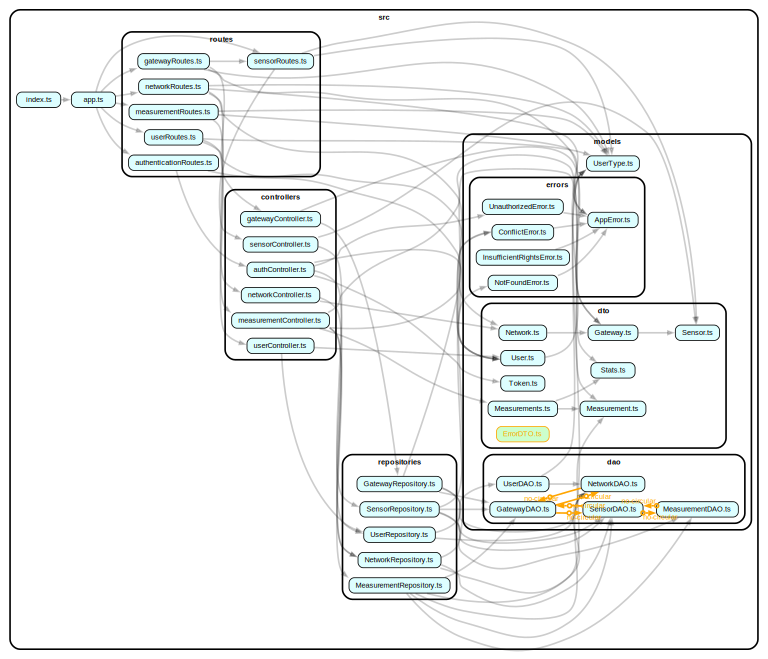
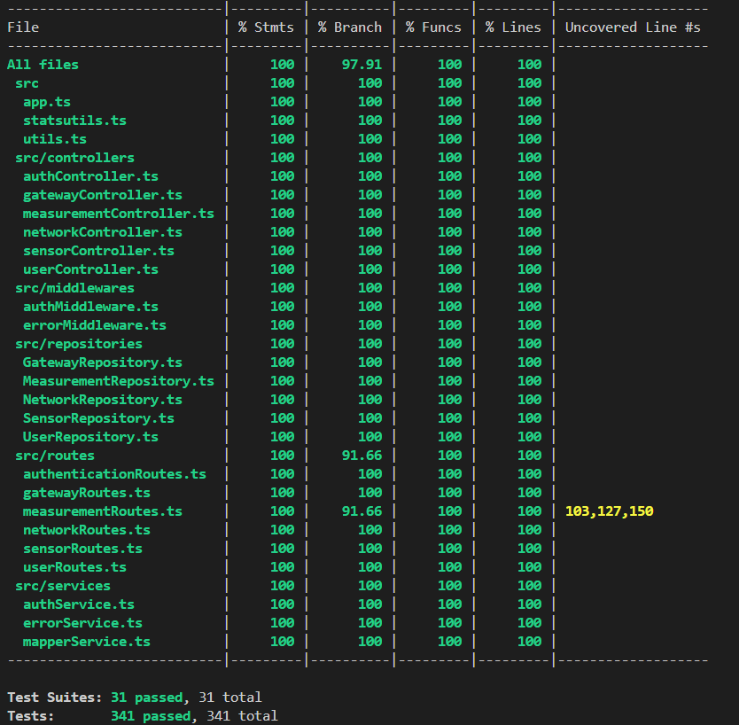
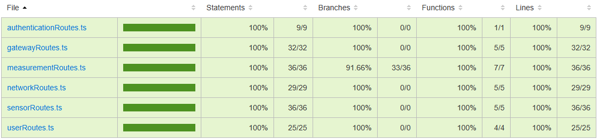
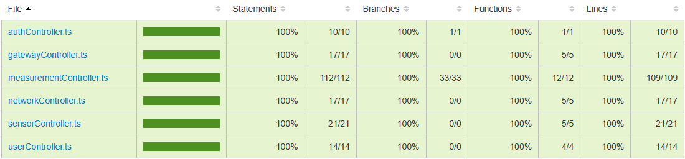
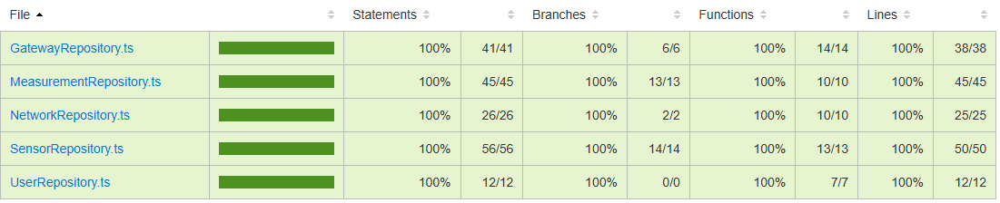
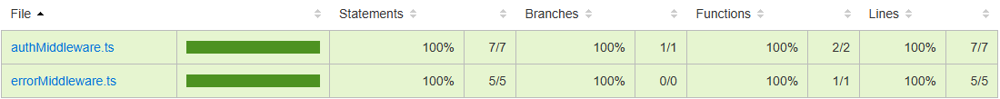
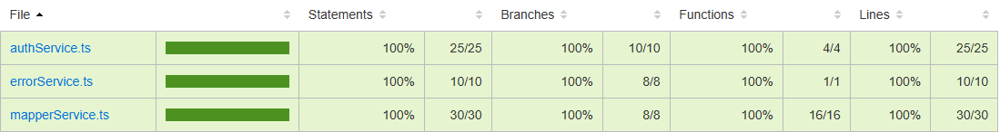
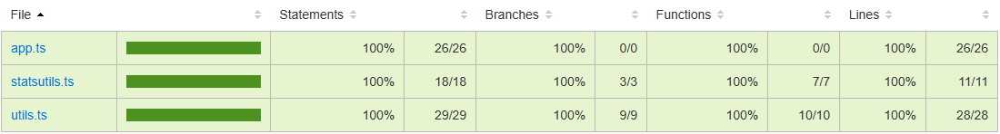

# Test Report

This document explains the testing methodology and results for the GeoControl application.

# Contents

- [Test Report](#test-report)
- [Contents](#contents)
- [Dependency graph](#dependency-graph)
- [Integration approach](#integration-approach)
- [Tests](#tests)
- [Coverage](#coverage)
  - [Coverage of FR](#coverage-of-fr)
  - [Coverage white box](#coverage-white-box)

# Dependency graph

# Integration approach

GeoControl's testing used a systematic mixed integration approach that combines aspects of both bottom-up and top-down methodologies to ensure comprehensive validation at all levels:

**Step 1: Foundation Components Testing**
- Independent testing of utility functions (statsutils, mapperService, utils)
- Testing of repositories in isolation using mocks to verify data access logic
- Testing repositories with real database connections to validate DB interactions

**Step 2: Controller Integration**
- Testing controllers with repository dependencies
- Validating business logic implementation across component boundaries
- Verifying controller error handling and edge cases

**Step 3: API Route Integration**
- Testing route handlers with their corresponding controllers
- Validating request parsing, authentication, and authorization
- Verifying HTTP status codes and response formats

**Step 4: End-to-End Workflows**
- Testing complete user workflows across multiple API endpoints
- Validating system behavior in realistic usage scenarios
- Verifying proper data flow throughout all system layers

This mixed approach enabled incremental integration while maintaining system stability, allowing us to identify issues at the appropriate level of abstraction. The strategy ensured both low-level component correctness and adherence to high-level functional requirements.

# Tests

| Test case name | Object(s) tested | Test level | Technique used |
| :------------: | :--------------: | :--------: | :------------: |
| authService.test | Authentication Service | Unit | WB/ statement coverage |
| mapperService.test | DTO/Entity Mapping | Unit | WB/ statement coverage |
| statsutils.test | Statistical Functions | Unit | WB/ statement coverage |
| utils.test | Utility Functions | Unit | WB/ statement coverage |
| UserRepository.mock.test | User Repository | Unit | WB/ statement coverage |
| UserRepository.db.test | User Repository with DB | Unit | WB/ statement coverage |
| networkRepository.mock.test | Network Repository | Unit | WB/ statement coverage |
| networkRepository.db.test | Network Repository with DB | Unit | WB/ statement coverage |
| gatewayRepository.db.test | Gateway Repository with DB | Unit | WB/ statement coverage |
| sensorRepository.mock.test | Sensor Repository | Unit | WB/ statement coverage |
| sensorRepository.db.test | Sensor Repository with DB | Unit | WB/ statement coverage |
| MeasurementRepository.mock.test | Measurement Repository | Unit | WB/ statement coverage |
| authController.integration.test | Auth Controller | Integration | WB/ statement coverage |
| userController.integration.test | User Controller | Integration | WB/ statement coverage |
| networkController.integration.test | Network Controller | Integration | WB/ statement coverage |
| gatewayController.integration.test | Gateway Controller | Integration | WB/ statement coverage |
| sensorController.integration.test | Sensor Controller | Integration | WB/ statement coverage |
| measurementController.integration.test | Measurement Controller | Integration | WB/ statement coverage |
| authRoutes.integration.test | Auth Routes | Integration | WB/ statement coverage |
| userRoutes.integration.test | User Routes | Integration | WB/ statement coverage |
| networkRoutes.integration.test | Network Routes | Integration | WB/ statement coverage |
| gatewayRoutes.integration.test | Gateway Routes | Integration | WB/ statement coverage |
| sensorRoutes.integration.test | Sensor Routes | Integration | WB/ statement coverage |
| measurementRoutes.integration.test | Measurement Routes | Integration | WB/ statement coverage |
| users.e2e.test | User API Workflows | E2E | WB/ statement coverage |
| networks.e2e.test | Network API Workflows | E2E | WB/ statement coverage |
| gateways.e2e.test | Gateway API Workflows | E2E | WB/ statement coverage |
| sensors.e2e.test | Sensor API Workflows | E2E | WB/ statement coverage |
| measurements.e2e.test | Measurement API Workflows | E2E | WB/ statement coverage |

# Coverage

## Coverage of FR

| Functional Requirement | Number of Tests |
| :--------------------: | :-------------: |
| FR1.1 - Authenticate user | 9 |
| FR2.1 - Retrieve all users | 6 |
| FR2.2 - Create a new user | 8 |
| FR2.3 - Retrieve a specific user | 7 |
| FR2.4 - Delete a specific user | 6 |
| FR3.1 - Retrieve all networks | 6 |
| FR3.2 - Create a new network | 7 |
| FR3.3 - Retrieve a specific network | 6 |
| FR3.4 - Update a network | 8 |
| FR3.5 - Delete a specific network | 5 |
| FR4.1 - Retrieve all gateways of a network | 5 |
| FR4.2 - Create a new gateway for a network | 9 |
| FR4.3 - Retrieve a specific gateway | 6 |
| FR4.4 - Update a gateway | 8 |
| FR4.5 - Delete a specific gateway | 6 |
| FR5.1 - Retrieve all sensors of a gateway | 6 |
| FR5.2 - Create a new sensor for a gateway | 11 |
| FR5.3 - Retrieve a specific sensor | 7 |
| FR5.4 - Update a sensor | 9 |
| FR5.5 - Delete a specific sensor | 5 |
| FR6.1 - Retrieve measurements for a set of sensors of a specific network | 12 |
| FR6.2 - Retrieve statistics for a set of sensors of a specific network | 8 |
| FR6.3 - Retrieve outliers for a set of sensors of a specific network | 7 |
| FR6.4 - Store measurements for a specific sensor | 9 |
| FR6.5 - Retrieve measurements for a specific sensor | 8 |
| FR6.6 - Retrieve statistics for a specific sensor | 6 |
| FR6.7 - Retrieve outliers for a specific sensor | 4 |

## Coverage white box

General values:

**NOTE**: lines 103, 127 and 150 were not covered because "req.query.sensorMacs" is automatically casted to an array (even if an integer value is passed). However, the check is still leaved in the code just to be on the safe side.

### Routes coverage 

### Controllers coverage

### Repositories coverage

### Middlewares coverage

### Services coverage

### Entry-points e utility coverage

