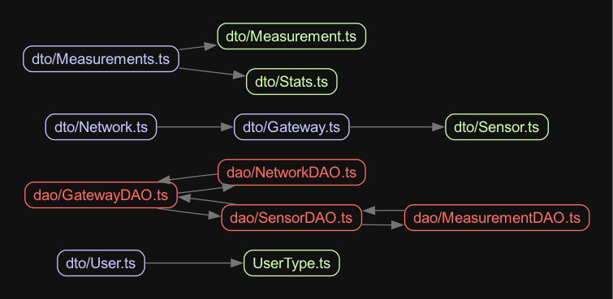
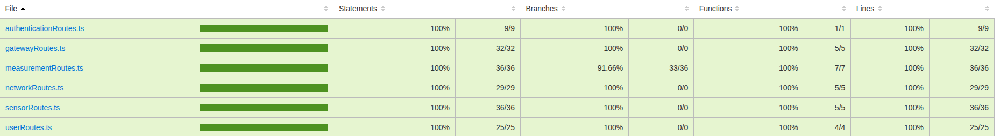
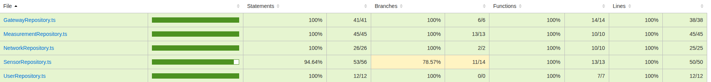
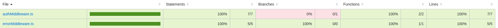
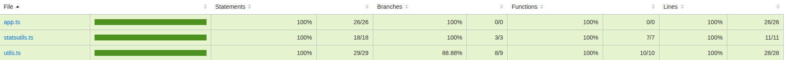

# Test Report

This document explains the testing methodology and results for the GeoControl application.

# Contents

- [Test Report](#test-report)
- [Contents](#contents)
- [Dependency graph](#dependency-graph)
- [Integration approach](#integration-approach)
- [Tests](#tests)
- [Coverage](#coverage)
  - [Coverage of FR](#coverage-of-fr)
  - [Coverage white box](#coverage-white-box)

# Dependency graph

# Integration approach

GeoControl's testing used a systematic mixed integration approach that combines aspects of both bottom-up and top-down methodologies to ensure comprehensive validation at all levels:

**Step 1: Foundation Components Testing**
- Independent testing of utility functions (statsutils, mapperService, utils)
- Testing of repositories in isolation using mocks to verify data access logic
- Testing repositories with real database connections to validate DB interactions

**Step 2: Controller Integration**
- Testing controllers with repository dependencies
- Validating business logic implementation across component boundaries
- Verifying controller error handling and edge cases

**Step 3: API Route Integration**
- Testing route handlers with their corresponding controllers
- Validating request parsing, authentication, and authorization
- Verifying HTTP status codes and response formats

**Step 4: End-to-End Workflows**
- Testing complete user workflows across multiple API endpoints
- Validating system behavior in realistic usage scenarios
- Verifying proper data flow throughout all system layers

This mixed approach enabled incremental integration while maintaining system stability, allowing us to identify issues at the appropriate level of abstraction. The strategy ensured both low-level component correctness and adherence to high-level functional requirements.

# Tests

| Test case name | Object(s) tested | Test level | Technique used |
| :------------: | :--------------: | :--------: | :------------: |
| authService.test | Authentication Service | Unit | White Box |
| mapperService.test | DTO/Entity Mapping | Unit | White Box |
| statsutils.test | Statistical Functions | Unit | White Box |
| utils.test | Utility Functions | Unit | White Box |
| UserRepository.mock.test | User Repository | Unit | White Box |
| UserRepository.db.test | User Repository with DB | Unit | White Box |
| networkRepository.mock.test | Network Repository | Unit | White Box |
| networkRepository.db.test | Network Repository with DB | Unit | White Box |
| gatewayRepository.db.test | Gateway Repository with DB | Unit | White Box |
| sensorRepository.mock.test | Sensor Repository | Unit | Black Box + White Box |
| sensorRepository.db.test | Sensor Repository with DB | Unit | Black Box + White Box |
| MeasurementRepository.mock.test | Measurement Repository | Unit | White Box |
| authController.integration.test | Auth Controller | Integration | White Box |
| userController.integration.test | User Controller | Integration | White Box |
| networkController.integration.test | Network Controller | Integration | Black Box + White Box |
| gatewayController.integration.test | Gateway Controller | Integration | White Box |
| sensorController.integration.test | Sensor Controller | Integration | White Box |
| measurementController.integration.test | Measurement Controller | Integration | White Box |
| authRoutes.integration.test | Auth Routes | Integration | White Box |
| userRoutes.integration.test | User Routes | Integration | Black Box + White Box |
| networkRoutes.integration.test | Network Routes | Integration | Black Box + White Box |
| gatewayRoutes.integration.test | Gateway Routes | Integration | Black Box + White Box |
| sensorRoutes.integration.test | Sensor Routes | Integration | Black Box + White Box |
| measurementRoutes.integration.test | Measurement Routes | Integration | Black Box + White Box |
| users.e2e.test | User API Workflows | E2E | White Box |
| networks.e2e.test | Network API Workflows | E2E | White Box |
| gateways.e2e.test | Gateway API Workflows | E2E | White Box |
| sensors.e2e.test | Sensor API Workflows | E2E | White Box |
| measurements.e2e.test | Measurement API Workflows | E2E | Black Box + White Box |

# Coverage

## Coverage of FR

| Functional Requirement | Number of Tests |
| :--------------------: | :-------------: |
| FR1.1 - Authenticate user | 9 |
| FR2.1 - Retrieve all users | 6 |
| FR2.2 - Create a new user | 8 |
| FR2.3 - Retrieve a specific user | 7 |
| FR2.4 - Delete a specific user | 6 |
| FR3.1 - Retrieve all networks | 6 |
| FR3.2 - Create a new network | 7 |
| FR3.3 - Retrieve a specific network | 6 |
| FR3.4 - Update a network | 8 |
| FR3.5 - Delete a specific network | 5 |
| FR4.1 - Retrieve all gateways of a network | 5 |
| FR4.2 - Create a new gateway for a network | 9 |
| FR4.3 - Retrieve a specific gateway | 6 |
| FR4.4 - Update a gateway | 8 |
| FR4.5 - Delete a specific gateway | 6 |
| FR5.1 - Retrieve all sensors of a gateway | 6 |
| FR5.2 - Create a new sensor for a gateway | 11 |
| FR5.3 - Retrieve a specific sensor | 7 |
| FR5.4 - Update a sensor | 9 |
| FR5.5 - Delete a specific sensor | 5 |
| FR6.1 - Retrieve measurements for a set of sensors of a specific network | 12 |
| FR6.2 - Retrieve statistics for a set of sensors of a specific network | 8 |
| FR6.3 - Retrieve outliers for a set of sensors of a specific network | 7 |
| FR6.4 - Store measurements for a specific sensor | 9 |
| FR6.5 - Retrieve measurements for a specific sensor | 8 |
| FR6.6 - Retrieve statistics for a specific sensor | 6 |
| FR6.7 - Retrieve outliers for a specific sensor | 4 |

## Coverage white box

### Routes coverage 

### Repository coverage

### Middleware coverage

### Services coverage

### Entry-points e utility coverage

